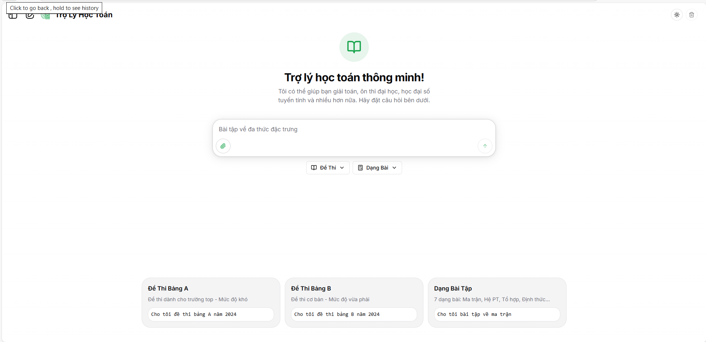
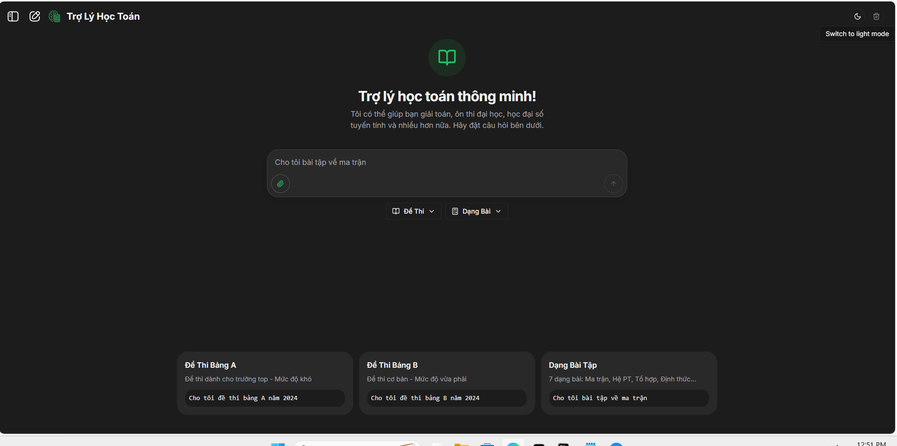
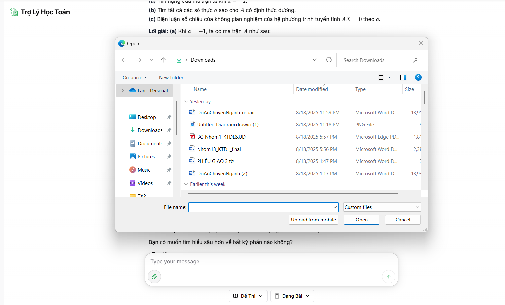
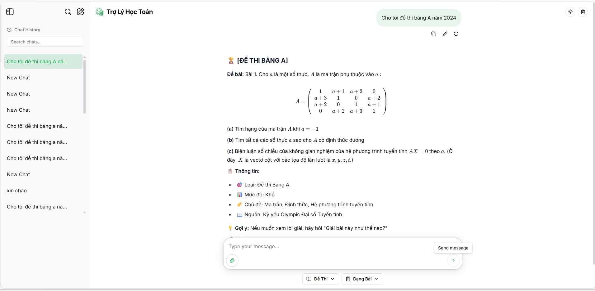

# 🤖 Trợ Lý Học Toán - AI Math Chatbot

[](https://www.python.org/downloads/)
[](https://fastapi.tiangolo.com/)
[](https://nextjs.org/)
[](https://www.typescriptlang.org/)
[](https://opensource.org/licenses/MIT)

> **Một trợ lý học toán thông minh giúp giải bài toán từ số học cơ bản đến giải tích nâng cao, đại số tuyến tính, thống kê và nhiều hơn nữa.**

## 🚀 Điểm nổi bật của dự án

- **🧮 Giải toán từng bước** sử dụng Google Gemini LLM
- **📚 Giải thích khái niệm toán học** với ví dụ thực tế
- **🔢 Hiển thị LaTeX** cho công thức toán đẹp mắt (KaTeX)
- **📁 Hỗ trợ tải lên file** (ảnh, PDF, text, DOCX) với xử lý backend thông minh
- **⚡ Phản hồi dạng streaming** với hiệu ứng gõ chữ thời gian thực
- **💾 Quản lý lịch sử chat** với lưu trữ bền vững (SQLite + SQLAlchemy)
- **🛡️ Xử lý lỗi mạnh mẽ** và hỗ trợ truy cập (A11y)
- **🎨 Giao diện giống ChatGPT** với các thành phần Shadcn UI
- **📱 Responsive design** tối ưu cho mọi thiết bị
- **🧠 RAG System** - Retrieval-Augmented Generation với Qdrant vector database
- **📊 Data Management** - Hệ thống quản lý và upload dữ liệu toán học

## 🖼️ Demo

| Chế độ sáng | Chế độ tối | Upload file | Giao diện chat |
|-------------|------------|-------------|----------------|
|  |  |  |  |

## 🧠 Kỹ năng AI & Kỹ thuật thể hiện

### AI/ML Capabilities
- **Large Language Model Integration:** Google Gemini Pro API cho giải toán nâng cao
- **RAG System:** Retrieval-Augmented Generation với vector search thông minh
- **Prompt Engineering:** Tùy chỉnh hướng dẫn hệ thống để định nghĩa tính cách chatbot
- **Multi-modal Input Processing:** Hỗ trợ text, ảnh, PDF, DOCX với xử lý thông minh
- **Context Management:** Lưu trữ lịch sử chat nhiều lượt cho hội thoại mạch lạc
- **Streaming Responses:** Phản hồi LLM dạng streaming cho trải nghiệm tức thì

### Technical Excellence
- **Full-stack Architecture:** Backend FastAPI + Frontend Next.js/React
- **Vector Database:** Qdrant cho semantic search và RAG system
- **Database Design:** SQLite với SQLAlchemy ORM, Alembic migrations
- **Data Pipeline:** Hệ thống xử lý và upload dữ liệu toán học tự động
- **Error Handling:** Exception handling, logging, user-friendly error messages
- **Accessibility:** WCAG 2.1 AA compliance, semantic HTML, keyboard navigation
- **Performance:** Rate limiting, middleware optimization, efficient file processing

## 🗂️ Công nghệ sử dụng

### Backend Stack
- **Python 3.9+** - Ngôn ngữ lập trình chính
- **FastAPI** - Web framework hiện đại, hiệu suất cao
- **Google Gen AI SDK** - Gemini 2.5 Flash cho xử lý toán học
- **Qdrant** - Vector database cho RAG system
- **SQLAlchemy** - ORM với SQLite database
- **Pydantic** - Data validation và serialization
- **Alembic** - Database migration management

### Frontend Stack
- **Next.js 14** - React framework với App Router
- **TypeScript** - Type-safe JavaScript
- **Tailwind CSS** - Utility-first CSS framework
- **Shadcn/ui** - High-quality React components
- **KaTeX** - LaTeX rendering cho công thức toán
- **Zustand** - Lightweight state management

### DevOps & Tools
- **Docker** - Containerization cho development và deployment
- **Git** - Version control
- **SQLite** - Lightweight database

## 🏗️ Cấu trúc dự án

```
ai-math-chatbot-main/
├── 📁 backend/                 # Backend FastAPI application
│   ├── 📁 app/                 # Main application code
│   │   ├── 📁 adapters/        # Service adapters
│   │   ├── 📁 config/          # Configuration management
│   │   ├── 📁 crud/            # Database CRUD operations
│   │   ├── 📁 middleware/      # Custom middleware
│   │   ├── 📁 rag/             # RAG (Retrieval-Augmented Generation)
│   │   │   ├── 📁 config/      # RAG configuration
│   │   │   ├── 📄 qdrant_connector.py
│   │   │   ├── 📄 rag_service.py
│   │   │   └── 📄 retriever_semantic.py
│   │   ├── 📁 routers/         # API route handlers
│   │   ├── 📁 services/        # Business logic services
│   │   └── 📁 utils/           # Utility functions
│   ├── 📁 migrations/          # Database migrations
│   ├── 📁 data_ingestion/      # Data processing pipelines
│   ├── requirements.txt         # Python dependencies
│   └── Dockerfile              # Backend container
├── 📁 frontend/                # Frontend Next.js application
│   ├── 📁 app/                 # Next.js app directory
│   ├── 📁 components/          # React components
│   ├── 📁 hooks/               # Custom React hooks
│   ├── 📁 lib/                 # Utilities and services
│   ├── 📁 public/              # Static assets
│   ├── package.json            # Node.js dependencies
│   └── Dockerfile              # Frontend container
├── 📁 docs/                    # Project documentation
├── 📁 data/                    # Data files and scripts
│   ├── 📁 scripts/             # Data processing scripts
│   │   ├── 📄 final_md_to_json_processor.py
│   │   ├── 📄 import_to_qdrant_hybrid.py
│   │   ├── 📄 qdrant_smoke_check.py
│   │   └── 📄 smart_latex_translator.py
│   ├── 📁 raw/                 # Raw Markdown data
│   └── 📁 processed/           # Processed JSON data
├── 📁 assets/                  # Demo images and screenshots
├── docker-compose.yml          # Development environment
└── README.md                   # This file
```

## 🚀 Khởi chạy dự án

### Yêu cầu hệ thống
- Python 3.9+
- Node.js 18+
- Docker & Docker Compose (khuyến nghị)
- Qdrant vector database

### Cách 1: Sử dụng Docker (Khuyến nghị)

```bash
# Clone repository
git clone https://github.com/yourusername/ai-math-chatbot.git
cd ai-math-chatbot

# Khởi chạy với Docker Compose
docker-compose up -d

# Truy cập ứng dụng
# Frontend: http://localhost:3000
# Backend API: http://localhost:8000
# API Docs: http://localhost:8000/docs
# Qdrant: http://localhost:6333
```

### Cách 2: Khởi chạy thủ công

#### Backend
```bash
cd backend
python -m venv venv
source venv/bin/activate  # Windows: venv\Scripts\activate
pip install -r requirements.txt

# Tạo file .env từ .env.example
cp .env.example .env
# Cập nhật GOOGLE_API_KEY trong .env

# Khởi chạy server
uvicorn app.main:app --reload --host 0.0.0.0 --port 8000
```

#### Frontend
```bash
cd frontend
npm install
# hoặc
pnpm install

# Khởi chạy development server
npm run dev
# hoặc
pnpm dev
```

## 🔧 Cấu hình

### Biến môi trường Backend
Tạo file `.env` trong thư mục `backend/`:

```env
GOOGLE_API_KEY=your_gemini_api_key_here
DATABASE_URL=sqlite:///./aichatbot.db
SECRET_KEY=your_secret_key_here
QDRANT_HOST=localhost
QDRANT_PORT=6333
```

### Biến môi trường Frontend
Tạo file `.env.local` trong thư mục `frontend/`:

```env
NEXT_PUBLIC_API_BASE_URL=http://localhost:8000
```

## 📚 API Documentation

Sau khi khởi chạy backend, truy cập:
- **Swagger UI:** http://localhost:8000/docs
- **ReDoc:** http://localhost:8000/redoc

### Endpoints chính
- `POST /chat/` - Gửi tin nhắn chat
- `POST /chat/stream` - Chat streaming
- `POST /files/upload` - Upload file
- `GET /chat/history` - Lấy lịch sử chat
- `POST /rag/search` - Tìm kiếm với RAG system

## 📊 Quản lý dữ liệu và RAG System

### Upload dữ liệu lên Qdrant
```bash
# 1. Kiểm tra kết nối Qdrant
python data/scripts/qdrant_smoke_check.py

# 2. Xử lý dữ liệu gốc (Markdown → JSON)
python data/scripts/final_md_to_json_processor.py

# 3. Upload dữ liệu lên Qdrant
python data/scripts/import_to_qdrant_hybrid.py
```

### Cấu trúc dữ liệu
- **Input:** File Markdown trong `data/raw/` (bài tập, lời giải toán học)
- **Processing:** Chuyển đổi thành JSON với metadata phong phú
- **Storage:** Qdrant vector database với embeddings và semantic search
- **Retrieval:** RAG system tìm kiếm thông tin liên quan

## 🧪 Kiểm thử

**Lưu ý:** Unit, integration, và E2E tests sẽ được bổ sung trong giai đoạn tiếp theo. Dự án đã được cấu trúc sẵn để dễ dàng tích hợp testing:

- **Backend:** `pytest` cho unit/integration tests
- **Frontend:** `jest` và `react-testing-library` cho component tests
- **E2E:** Playwright hoặc Cypress cho end-to-end testing

## 🔮 Định hướng phát triển

### Giai đoạn ngắn hạn
- [x] **RAG System:** Retrieval-Augmented Generation với Qdrant
- [x] **Data Pipeline:** Hệ thống xử lý và upload dữ liệu
- [ ] **Tính toán ký hiệu:** Tích hợp SymPy cho đại số và giải phương trình
- [ ] **Hệ thống đăng nhập:** User authentication và profile management

### Giai đoạn trung hạn
- [ ] **Dashboard quản trị:** Analytics và moderation tools
- [ ] **Đa ngôn ngữ:** Hỗ trợ nhiều ngôn ngữ
- [ ] **Mobile app:** React Native hoặc Flutter
- [ ] **Máy tính tích hợp:** Scientific calculator functionality

### Giai đoạn dài hạn
- [ ] **Cloud deployment:** One-click deployment lên GCP/AWS/Azure
- [ ] **Plugin system:** Extensible chatbot với plugin architecture
- [ ] **Advanced visualization:** Graphing và charting capabilities


